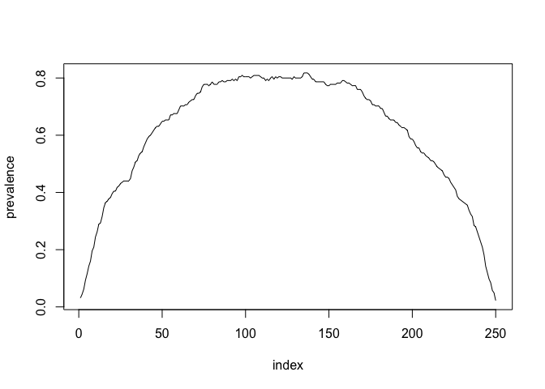

<!-- README.md is generated from README.Rmd. Please edit that file -->

# tsrf

<!-- badges: start -->

[](https://www.tidyverse.org/lifecycle/#experimental)
[](https://CRAN.R-project.org/package=tsrf)
<!-- badges: end -->

tsrf provides time series classification tools based on the Time Series
Random Forest algorithm by [Deng et al.
(2013)](https://doi.org/10.1016/j.ins.2013.02.030)

## Installation

You can install the development version of `tsrf` from
[GitHub](https://github.com/) with:

``` r
# install.packages("devtools")
devtools::install_github("FlukeAndFeather/tsrf")
```

## Example

This example demonstrates how `tsrf` extracts features, fits a model,
and makes predictions. First, generate 10 time series from two different
underlying classes

``` r
library(tsrf)
tsnum <- 10
tslbl <- factor(rep(c("A", "B"), each = tsnum))
tslen <- 100
Aval <- replicate(tsnum, rnorm(tslen))
Bval <- replicate(tsnum, c(rnorm(tslen / 2), cumsum(rnorm(tslen / 2, 0.1))))
tsdat <- data.frame(
  id = rep(1:(2 * tsnum), each = tslen),
  val = c(as.numeric(Aval), as.numeric(Bval))
)
summary(tsdat)
#>        id             val          
#>  Min.   : 1.00   Min.   :-10.5822  
#>  1st Qu.: 5.75   1st Qu.: -0.7238  
#>  Median :10.50   Median :  0.1323  
#>  Mean   :10.50   Mean   :  0.5898  
#>  3rd Qu.:15.25   3rd Qu.:  1.1098  
#>  Max.   :20.00   Max.   : 15.5768
```

Time series from the first class (red) have no trend but the second half
of time series from the second class trend upwards.

``` r
plot(seq(tslen), tsdat$val[tsdat$id == 1],
     type = "l", col = "#FF000088", ylim = range(tsdat$val))
for (i in 2:(tsnum * 2)) {
  lines(seq(tslen), tsdat$val[tsdat$id == i],
        col = if (i <= tsnum) "#FF000088" else "#0000FF88")
}
```


The features extracted from each time series are simple summary
statistics (mean, sd, slope) of randomly sampled intervals. Points
closer to the middle of the time series will end up in more intervals.
`extract_features()` converts long format time series data to wide
format, with one row per time series and a column for each feature.

``` r
tsints <- sample_intervals(tslen)
tsfeat <- extract_features(tsdat, "id", tsints)

prevalence <- sapply(
  seq(tslen),
  function(i) sum(i >= tsints[, 1] & i <= tsints[, 2]) / nrow(tsints)
)
plot(seq(tslen), prevalence, type = "l", xlab = "index")
```



``` r

head(tsfeat)
#>   id  mean_val_1  sd_val_1  slope_val_1  mean_val_2  sd_val_2   slope_val_2
#> 1  1 -0.03649156 1.1889587 -0.006777607 -0.16306319 1.1147479 -8.102549e-03
#> 2  2  0.14189128 0.8471984  0.002405030  0.04606340 0.8623643 -7.865638e-04
#> 3  3 -0.05509019 1.1359184  0.001816264 -0.05910067 1.0555795 -6.497745e-03
#> 4  4 -0.08324245 0.9102817  0.002179320 -0.02809003 0.8800187 -2.462682e-05
#> 5  5  0.11743297 0.9182558  0.011717641  0.20050655 0.9315587  7.748261e-03
#> 6  6 -0.10496462 1.0027772 -0.005716884 -0.22823249 0.9707039 -5.181281e-03
#>    mean_val_3  sd_val_3   slope_val_3  mean_val_4  sd_val_4  slope_val_4
#> 1 -0.22211290 1.0367580  0.0007179233 -0.02071797 1.1842579 -0.003864101
#> 2  0.07217422 0.8690114 -0.0038920676  0.18989547 0.8129478  0.003191025
#> 3 -0.13344561 1.0572223 -0.0069983469 -0.03323515 1.1680944  0.004021650
#> 4  0.01226620 0.8779029 -0.0003256435 -0.10453575 0.9267522  0.006234430
#> 5  0.20549871 0.9274747  0.0035347796  0.08472409 0.9595532  0.013659832
#> 6 -0.20572613 0.9402633 -0.0031286046 -0.06317026 1.0109365 -0.006139741
#>    mean_val_5  sd_val_5  slope_val_5  mean_val_6  sd_val_6  slope_val_6
#> 1 -0.13881218 1.1178251 -0.008454459 -0.09944995 1.1661586 -0.006190856
#> 2  0.08438085 0.8878026 -0.002229925  0.05954263 0.9277557 -0.001420449
#> 3 -0.05246807 1.0647686 -0.010146955 -0.02516260 1.0761528 -0.004005516
#> 4 -0.06608853 0.8535141 -0.001526701 -0.06077440 0.8847646 -0.002581104
#> 5  0.19203919 0.9268501  0.006464476  0.20638227 0.9132011  0.005674352
#> 6 -0.21701496 0.9693080 -0.004881382 -0.11896702 0.9712645 -0.004612713
#>    mean_val_7  sd_val_7  slope_val_7  mean_val_8  sd_val_8  slope_val_8
#> 1 -0.16095974 1.1733294 -0.001321663 -0.13881218 1.1178251 -0.008454459
#> 2  0.09080542 0.8906388 -0.003205211  0.08438085 0.8878026 -0.002229925
#> 3 -0.07111763 1.0690166 -0.009543178 -0.05246807 1.0647686 -0.010146955
#> 4 -0.07847550 0.8550079 -0.001270746 -0.06608853 0.8535141 -0.001526701
#> 5  0.14934139 0.9071596  0.005413831  0.19203919 0.9268501  0.006464476
#> 6 -0.20515854 0.9764462 -0.006336590 -0.21701496 0.9693080 -0.004881382
#>    mean_val_9  sd_val_9  slope_val_9 mean_val_10 sd_val_10  slope_val_10
#> 1 -0.02071797 1.1842579 -0.003864101 -0.20694430 1.0365200 -0.0033384309
#> 2  0.18989547 0.8129478  0.003191025  0.04305414 0.8671085 -0.0041736194
#> 3 -0.03323515 1.1680944  0.004021650 -0.10185892 1.0618896 -0.0068859300
#> 4 -0.10453575 0.9267522  0.006234430 -0.01390648 0.8822028  0.0003124737
#> 5  0.08472409 0.9595532  0.013659832  0.19780421 0.9348644  0.0049121096
#> 6 -0.06317026 1.0109365 -0.006139741 -0.21143149 0.9658842 -0.0058714001
#>   mean_val_11 sd_val_11  slope_val_11 mean_val_12 sd_val_12 slope_val_12
#> 1 -0.14271491 1.1856745 -0.0080312657 -0.05391246 1.1562256 -0.008473917
#> 2  0.05810332 0.9128851 -0.0013280730  0.05222993 0.9159560 -0.002096690
#> 3 -0.05707909 1.0745390 -0.0052188604 -0.07778294 1.0781981  0.002510109
#> 4 -0.03108345 0.9139054  0.0002558001 -0.09851525 0.9159073 -0.001103472
#> 5  0.21080979 0.9436616  0.0050692468  0.18659145 0.8982210  0.007612948
#> 6 -0.17624953 0.9656951 -0.0078057543 -0.12419809 1.0410553 -0.006951227
#>   mean_val_13 sd_val_13 slope_val_13 mean_val_14 sd_val_14 slope_val_14
#> 1 -0.01678047 1.1604348 -0.005430157 -0.04905732 1.1492938 -0.006722307
#> 2  0.16300619 0.8778325 -0.003346228  0.06786630 0.9121328 -0.004578541
#> 3 -0.09530853 1.1757657  0.005031937 -0.08758081 1.1184693  0.003032125
#> 4 -0.12298928 0.9058799  0.002022863 -0.12725815 0.9018589  0.001057223
#> 5  0.10104011 0.9304646  0.010154662  0.11339685 0.8923008  0.008060851
#> 6 -0.06164477 0.9834822 -0.004922100 -0.04559578 0.9927742 -0.000450694
#>    mean_val_15 sd_val_15 slope_val_15  mean_val_16 sd_val_16 slope_val_16
#> 1 -0.272424083 1.0992575 -0.005462025 -0.175851577 1.1399404 -0.009524594
#> 2  0.005114695 0.8811060 -0.007324522  0.046748887 0.8934430 -0.004497690
#> 3 -0.099807396 1.0612610 -0.005505448 -0.067007035 1.0558181 -0.008946471
#> 4  0.017746247 0.8827218  0.001692125 -0.005357373 0.8578678  0.003185241
#> 5  0.197811756 0.9172007  0.004198654  0.187951024 0.9085747  0.004766216
#> 6 -0.150116607 0.9365969 -0.002078531 -0.186616043 0.9432851 -0.001473672
#>   mean_val_17 sd_val_17 slope_val_17 mean_val_18 sd_val_18  slope_val_18
#> 1 -0.04473406 1.1472217 -0.004281965 -0.14649812 1.1884049 -0.0062277009
#> 2  0.10477805 0.8667149 -0.002995608  0.07105794 0.9090949 -0.0007669514
#> 3 -0.05596642 1.1369295  0.002628825 -0.09969874 1.0887930 -0.0044572599
#> 4 -0.12682703 0.9057612  0.002081872 -0.04808007 0.8898021 -0.0024367120
#> 5  0.08256157 0.9290980  0.010299428  0.20285554 0.9394446  0.0040183627
#> 6 -0.04908535 0.9850663 -0.004660741 -0.20223781 1.0061402 -0.0045755152
#>   mean_val_19 sd_val_19 slope_val_19 mean_val_20 sd_val_20 slope_val_20
#> 1 -0.04202930 1.1522446 -0.005705138 -0.11510259 1.1605905 -0.008930335
#> 2  0.05947008 0.9100590 -0.004104797  0.08926781 0.9242517 -0.001593060
#> 3 -0.05125574 1.0977981  0.001704553 -0.08796737 1.1155735 -0.002807484
#> 4 -0.12404755 0.8978836 -0.001288445 -0.06684636 0.9373398  0.002375667
#> 5  0.10937259 0.8911879  0.008580061  0.15671030 0.9174550  0.002367140
#> 6 -0.06845215 1.0082055 -0.001872748 -0.14543388 0.9964378 -0.003894482
#>   mean_val_21 sd_val_21 slope_val_21 mean_val_22 sd_val_22 slope_val_22
#> 1 -0.24581660 1.0719599 -0.005849203 -0.17982707 1.1741675 -0.002339608
#> 2  0.02916241 0.8620023 -0.004561978  0.07652614 0.8863219 -0.003615755
#> 3 -0.11154912 1.0328664 -0.006262533 -0.08751126 1.0663277 -0.009082115
#> 4  0.03108550 0.8767241  0.003736575 -0.02778396 0.8616724  0.002765105
#> 5  0.21512277 0.9172486  0.005399734  0.16830336 0.9198613  0.005681878
#> 6 -0.16823731 0.9470719 -0.001491716 -0.18852958 0.9515996 -0.003820868
#>   mean_val_23 sd_val_23  slope_val_23 mean_val_24 sd_val_24  slope_val_24
#> 1 -0.13318394 1.1908718 -0.0075779503 -0.03802914 1.1535722 -0.0039068477
#> 2  0.06813440 0.9149454 -0.0005581791  0.13167153 0.8405341 -0.0009082924
#> 3 -0.07356544 1.0722811 -0.0067883770 -0.06041777 1.1440320  0.0023709950
#> 4 -0.05663433 0.8927655 -0.0018337602 -0.12528188 0.9118444  0.0022944268
#> 5  0.20017707 0.9455689  0.0044036496  0.09088398 0.9326211  0.0114067265
#> 6 -0.16878549 0.9701064 -0.0075130559 -0.05702033 0.9893742 -0.0055044680
#>   mean_val_25 sd_val_25  slope_val_25  mean_val_26 sd_val_26  slope_val_26
#> 1 -0.05453607 1.1654985 -0.0085866625 -0.265791707 1.0854360 -0.0039717303
#> 2  0.06359978 0.9219645 -0.0013331073  0.022013556 0.8709493 -0.0128409535
#> 3 -0.07218148 1.1076513  0.0002094047 -0.089941936 1.0635363 -0.0037760842
#> 4 -0.09001923 0.9277820  0.0002484634  0.009669369 0.8741248  0.0029597582
#> 5  0.20278769 0.8936813  0.0048490872  0.233878473 0.9222612  0.0043076817
#> 6 -0.11380038 1.0088306 -0.0044003556 -0.172227628 0.9222691  0.0001064366
#>   mean_val_27 sd_val_27 slope_val_27 mean_val_28 sd_val_28 slope_val_28
#> 1 -0.11751883 1.1722227 -0.006154249 -0.24581660 1.0719599 -0.005849203
#> 2  0.08890154 0.9313209 -0.002600278  0.02916241 0.8620023 -0.004561978
#> 3 -0.11927879 1.1088515 -0.002704239 -0.11154912 1.0328664 -0.006262533
#> 4 -0.03509774 0.9031216 -0.003778016  0.03108550 0.8767241  0.003736575
#> 5  0.15824429 0.9188662  0.001986119  0.21512277 0.9172486  0.005399734
#> 6 -0.18799374 1.0001989 -0.003263574 -0.16823731 0.9470719 -0.001491716
#>   mean_val_29 sd_val_29 slope_val_29  mean_val_30 sd_val_30 slope_val_30
#> 1 -0.11751883 1.1722227 -0.006154249 -0.189380829 1.1416430 -0.008804023
#> 2  0.08890154 0.9313209 -0.002600278  0.020898099 0.8708438 -0.002557805
#> 3 -0.11927879 1.1088515 -0.002704239 -0.089812005 1.0442620 -0.007439754
#> 4 -0.03509774 0.9031216 -0.003778016  0.004870433 0.8591073  0.002475499
#> 5  0.15824429 0.9188662  0.001986119  0.184904637 0.9143909  0.005212476
#> 6 -0.18799374 1.0001989 -0.003263574 -0.189751681 0.9493303 -0.001276510
#>   mean_val_31 sd_val_31 slope_val_31 mean_val_32 sd_val_32  slope_val_32
#> 1 -0.18143752 0.9546545 -0.006427734 -0.13522792 1.3201772  0.0020180468
#> 2  0.10576570 0.8934605 -0.017194984  0.17279374 0.7665071  0.0061119476
#> 3 -0.00626523 1.0844934 -0.003214820  0.07435667 1.0875653 -0.0005983824
#> 4 -0.08219960 0.9179400 -0.014128853  0.01054290 0.8517418  0.0104584164
#> 5  0.34440059 0.8287977  0.002263769  0.10856438 0.9704785  0.0177464705
#> 6 -0.13104246 0.8811858 -0.022777946 -0.05728530 0.9028262  0.0100986441
#>   mean_val_33 sd_val_33  slope_val_33 mean_val_34 sd_val_34 slope_val_34
#> 1 -0.02243719 1.3284883 -0.0146241057 -0.18143752 0.9546545 -0.006427734
#> 2  0.15207954 0.8838418  0.0099057776  0.10576570 0.8934605 -0.017194984
#> 3 -0.07375720 1.0816703  0.0001742993 -0.00626523 1.0844934 -0.003214820
#> 4 -0.06513379 0.9794527  0.0106113988 -0.08219960 0.9179400 -0.014128853
#> 5  0.10010450 0.9890176  0.0063762304  0.34440059 0.8287977  0.002263769
#> 6 -0.03542409 1.0162448  0.0086040881 -0.13104246 0.8811858 -0.022777946
#>   mean_val_35 sd_val_35  slope_val_35 mean_val_36 sd_val_36 slope_val_36
#> 1 -0.15111580 0.9434653  0.0004952131 -0.26389827 0.9538256 -0.005514624
#> 2  0.08291481 0.8804584 -0.0178925795  0.02342608 0.9028430 -0.017527151
#> 3 -0.02837909 1.0583376 -0.0057716746 -0.16626928 1.1107534 -0.013453508
#> 4 -0.06805214 0.9239267 -0.0112613009 -0.02532968 0.9043810  0.001735766
#> 5  0.30378359 0.8478097  0.0104319366  0.31812619 0.8681919 -0.007863028
#> 6 -0.05118890 0.9471024 -0.0148551877 -0.25139044 0.9020577 -0.018820230
#>   mean_val_37 sd_val_37 slope_val_37 mean_val_38 sd_val_38 slope_val_38
#> 1 -0.09473780 1.3329991 -0.000527930 -0.11145573 1.0577663  0.004635849
#> 2  0.18501416 0.7642552  0.006966726  0.25197901 0.6282360  0.005062928
#> 3  0.02310518 1.1442587  0.006882833  0.02032855 1.1002393  0.002395213
#> 4  0.03763689 0.9141634 -0.001870235 -0.04278388 0.8621680  0.001267817
#> 5  0.07390370 0.9755620  0.018611370  0.18400394 0.9022082  0.022082467
#> 6 -0.06619332 0.8946741  0.005113921 -0.16730620 0.9338759  0.001075783
#>    mean_val_39 sd_val_39 slope_val_39 mean_val_40 sd_val_40  slope_val_40
#> 1 -0.169657532 0.9820928  -0.01014156 -0.15111580 0.9434653  0.0004952131
#> 2  0.072018938 0.8712765  -0.01171834  0.08291481 0.8804584 -0.0178925795
#> 3 -0.144400648 1.1446646  -0.01477349 -0.02837909 1.0583376 -0.0057716746
#> 4 -0.001221393 0.9194209  -0.01740188 -0.06805214 0.9239267 -0.0112613009
#> 5  0.252969008 0.8464098  -0.01014724  0.30378359 0.8478097  0.0104319366
#> 6 -0.184232677 0.9194718  -0.02020821 -0.05118890 0.9471024 -0.0148551877
#>   mean_val_41 sd_val_41  slope_val_41 mean_val_42 sd_val_42 slope_val_42
#> 1 -0.20449154 1.2067767 -0.0066921610 -0.04103828 1.1373391 -0.005614626
#> 2  0.05859989 0.8851843 -0.0050507514  0.07670206 0.9044823 -0.003548694
#> 3 -0.10721268 1.0764077 -0.0051975511 -0.08527296 1.1090737  0.002959509
#> 4  0.02084660 0.9002331  0.0009120503 -0.12031594 0.9135322  0.001536664
#> 5  0.16103809 0.9117784  0.0064463478  0.14470305 0.9193442  0.009854630
#> 6 -0.16460961 0.9408062 -0.0030293018 -0.08311477 1.0066587 -0.003262197
#>   mean_val_43 sd_val_43 slope_val_43 mean_val_44 sd_val_44 slope_val_44
#> 1 -0.12004009 1.1815327 -0.005686052 -0.06175190 1.1377437 -0.005255903
#> 2  0.04534978 0.9178034 -0.002169876  0.07653393 0.9078439 -0.004871710
#> 3 -0.09065944 1.0818950 -0.007362283 -0.06916887 1.1260047  0.001435400
#> 4 -0.01987808 0.9050331  0.001081685 -0.13352812 0.9004472  0.001431557
#> 5  0.19021678 0.9424447  0.003132625  0.08408984 0.9186466  0.009642799
#> 6 -0.16252704 0.9576233 -0.006164429 -0.02176294 0.9929872 -0.002214444
#>   mean_val_45 sd_val_45  slope_val_45 mean_val_46 sd_val_46  slope_val_46
#> 1 -0.20449154 1.2067767 -0.0066921610 -0.05285454 1.1440938 -7.736454e-03
#> 2  0.05859989 0.8851843 -0.0050507514  0.06291927 0.9093798 -1.138334e-03
#> 3 -0.10721268 1.0764077 -0.0051975511 -0.08897382 1.0892826  1.433834e-03
#> 4  0.02084660 0.9002331  0.0009120503 -0.08598464 0.9151239 -4.884844e-05
#> 5  0.16103809 0.9117784  0.0064463478  0.17639957 0.8899541  6.253160e-03
#> 6 -0.16460961 0.9408062 -0.0030293018 -0.10253160 1.0410972 -4.761917e-03
#>    mean_val_47 sd_val_47 slope_val_47  mean_val_48 sd_val_48 slope_val_48
#> 1 -0.232334716 1.1989722 -0.006018498 -0.255153435 1.0917387 -0.005825606
#> 2  0.046995800 0.8876994 -0.005434628 -0.008072325 0.8732458 -0.006839903
#> 3 -0.082312670 1.0471418 -0.007690941 -0.097897328 1.0480830 -0.004579145
#> 4  0.007277105 0.8680190  0.005105704  0.011349856 0.8722764  0.001870124
#> 5  0.189795063 0.9156355  0.006691208  0.218987786 0.9199869  0.005124997
#> 6 -0.164963134 0.9405407 -0.001617872 -0.168767059 0.9323069 -0.001390769
#>   mean_val_49 sd_val_49 slope_val_49 mean_val_50 sd_val_50  slope_val_50
#> 1 -0.12368319 1.1811483 -0.007484510 -0.06760175 1.1501009 -0.0068105064
#> 2  0.08725008 0.9134399 -0.001915132  0.06574597 0.9202299 -0.0029880853
#> 3 -0.09764757 1.1093770 -0.004319313 -0.05980349 1.1155979  0.0010060338
#> 4 -0.05711579 0.9084968 -0.001529072 -0.10884834 0.9065060 -0.0002304721
#> 5  0.19885254 0.9314784  0.004002912  0.14551401 0.9224088  0.0101586900
#> 6 -0.19360313 0.9973444 -0.004896335 -0.14056805 1.0339246 -0.0051904497
#>   mean_val_51 sd_val_51  slope_val_51 mean_val_52 sd_val_52  slope_val_52
#> 1 -0.09755952 1.1629275 -0.0072154069 -0.15572850 1.1831951 -0.0067043133
#> 2  0.08346088 0.9194640 -0.0019834810  0.06112038 0.9071602 -0.0015114255
#> 3 -0.10201215 1.1148553 -0.0037924999 -0.08308545 1.0911646 -0.0029890585
#> 4 -0.08830850 0.9496834  0.0006107347 -0.02297793 0.9105383 -0.0003857649
#> 5  0.15471996 0.9114832  0.0021198227  0.21331312 0.9376034  0.0046766791
#> 6 -0.16188791 1.0001128 -0.0050248814 -0.20916348 1.0012321 -0.0049369108
#>   mean_val_53 sd_val_53  slope_val_53  mean_val_54 sd_val_54  slope_val_54
#> 1 -0.09755952 1.1629275 -0.0072154069 -0.258549751 1.0985833 -0.0063303354
#> 2  0.08346088 0.9194640 -0.0019834810 -0.001094781 0.8768847 -0.0065552961
#> 3 -0.10201215 1.1148553 -0.0037924999 -0.102187265 1.0543664 -0.0051055055
#> 4 -0.08830850 0.9496834  0.0006107347  0.012487691 0.8780148  0.0020359557
#> 5  0.15471996 0.9114832  0.0021198227  0.200339306 0.9113319  0.0038381184
#> 6 -0.16188791 1.0001128 -0.0050248814 -0.163054545 0.9371442 -0.0009893984
#>   mean_val_55 sd_val_55  slope_val_55 mean_val_56 sd_val_56 slope_val_56
#> 1 -0.04809806 1.1509292 -0.0084264304 -0.06027378 1.1498297 -0.008639451
#> 2  0.05691173 0.9138829 -0.0007032634  0.06378654 0.9153902 -0.001114486
#> 3 -0.08648155 1.0962994  0.0012918057 -0.06534057 1.0764649  0.003381848
#> 4 -0.07914578 0.9192217 -0.0005979105 -0.10199363 0.9102859 -0.001331522
#> 5  0.17902619 0.8955670  0.0062931568  0.18548600 0.8922648  0.007230200
#> 6 -0.09429182 1.0454844 -0.0056115763 -0.12164090 1.0343319 -0.006481138
#>   mean_val_57 sd_val_57  slope_val_57 mean_val_58 sd_val_58  slope_val_58
#> 1 -0.04778367 1.1444313 -0.0054974801 -0.18613755 1.1358604 -0.0099550108
#> 2  0.08122286 0.9162008 -0.0018694575  0.03845490 0.8904074 -0.0049687405
#> 3 -0.08055382 1.1079515 -0.0006137514 -0.07096546 1.0493233 -0.0089063561
#> 4 -0.09971015 0.9089522  0.0004913645  0.01528287 0.8709203  0.0046694710
#> 5  0.15150364 0.9270293  0.0110442083  0.20394537 0.9132051  0.0058268321
#> 6 -0.11457640 1.0151558 -0.0033187356 -0.17733360 0.9404634 -0.0006929488
#>    mean_val_59 sd_val_59  slope_val_59 mean_val_60 sd_val_60  slope_val_60
#> 1 -0.229720503 1.1598272 -0.0112493692 -0.07042202 1.1574748 -0.0068573051
#> 2  0.006515544 0.8637078 -0.0034653087  0.04677979 0.9110689 -0.0015903144
#> 3 -0.067751484 1.0549325 -0.0051410571 -0.04297957 1.1131342 -0.0002996387
#> 4  0.008448013 0.8791031  0.0025213048 -0.10133495 0.9101127 -0.0008407622
#> 5  0.198658830 0.9131394  0.0058500907  0.16854536 0.9059767  0.0087225294
#> 6 -0.172328286 0.9426744  0.0001599429 -0.13731921 1.0403989 -0.0056579752
#>    mean_val_61 sd_val_61 slope_val_61 mean_val_62 sd_val_62 slope_val_62
#> 1 -0.109570543 1.0293587 -0.002361769 -0.05655386 1.4136161  -0.01420378
#> 2  0.236383180 0.7165510 -0.019098176  0.07875636 0.9943848   0.02270736
#> 3  0.003583821 1.2080021 -0.013248536  0.04588812 1.0992145   0.02714482
#> 4  0.081547699 0.8852611 -0.031093573 -0.11181085 0.8698348  -0.01709648
#> 5  0.305916778 0.8454009  0.017542116  0.03421750 1.0101385  -0.01069454
#> 6 -0.127484698 0.7772446 -0.034651758 -0.13325259 1.1633868   0.02155595
#>   mean_val_63 sd_val_63 slope_val_63  mean_val_64 sd_val_64 slope_val_64
#> 1 -0.14670747 0.9114683 -0.013952724  0.065152372 1.3517265 -0.007161383
#> 2 -0.04659935 0.9901296 -0.003738077  0.061423838 0.9903512 -0.017941195
#> 3 -0.19752781 1.0713657 -0.038626075 -0.172861467 1.1889125  0.002427732
#> 4 -0.17000373 0.8923460  0.002655820 -0.182533258 0.9552567  0.027753744
#> 5  0.27943157 0.7798532 -0.028236712 -0.184014128 1.0178161  0.011090578
#> 6 -0.38491529 1.0087618 -0.021608086  0.007456056 1.0913967 -0.031172083
#>   mean_val_65 sd_val_65 slope_val_65 mean_val_66 sd_val_66 slope_val_66
#> 1  0.09368059 1.3502629 -0.017526041 -0.24513444 0.9373745 -0.004517608
#> 2  0.05975686 0.9801427 -0.009636039 -0.09541109 1.0255095 -0.008062523
#> 3 -0.21931835 1.1429421  0.014103801 -0.31345692 1.0065570 -0.018858399
#> 4 -0.17859724 0.9334119  0.024008199 -0.05162707 0.9244840  0.022959733
#> 5 -0.11824746 0.9816960  0.002175672  0.27120455 0.8526981 -0.016897129
#> 6 -0.14196098 1.1206091 -0.035958705 -0.35882395 1.0252752 -0.007223979
#>   mean_val_67 sd_val_67 slope_val_67 mean_val_68 sd_val_68 slope_val_68
#> 1 -0.10664215 1.0349808 -0.002584224 -0.05655386 1.4136161  -0.01420378
#> 2  0.13524529 0.7225579 -0.020717441  0.07875636 0.9943848   0.02270736
#> 3 -0.05976816 1.0946729  0.001441043  0.04588812 1.0992145   0.02714482
#> 4 -0.05709309 0.8465276 -0.036235350 -0.11181085 0.8698348  -0.01709648
#> 5  0.32133950 0.7708636  0.008566262  0.03421750 1.0101385  -0.01069454
#> 6 -0.14988416 0.7475935 -0.017402556 -0.13325259 1.1633868   0.02155595
#>   mean_val_69 sd_val_69 slope_val_69 mean_val_70 sd_val_70 slope_val_70
#> 1 -0.24513444 0.9373745 -0.004517608 -0.11318737 1.0321215 -0.012521118
#> 2 -0.09541109 1.0255095 -0.008062523  0.20311402 0.6846932 -0.010441416
#> 3 -0.31345692 1.0065570 -0.018858399 -0.03849213 1.1902466 -0.006719311
#> 4 -0.05162707 0.9244840  0.022959733  0.06633990 0.8988374 -0.041369035
#> 5  0.27120455 0.8526981 -0.016897129  0.36574951 0.7852353  0.006963370
#> 6 -0.35882395 1.0252752 -0.007223979 -0.13957258 0.7823878 -0.038933095
#>   mean_val_71 sd_val_71 slope_val_71 mean_val_72 sd_val_72  slope_val_72
#> 1 -0.18696005 1.2012869 -0.007511355 -0.05224465 1.1261951 -0.0045444290
#> 2  0.03150973 0.9230976 -0.002708274  0.10229509 0.9070170 -0.0032238643
#> 3 -0.08848948 1.0696328 -0.006204795 -0.08119011 1.1295668 -0.0005449979
#> 4  0.01384944 0.8898208  0.001364889 -0.13023836 0.9101917  0.0026926454
#> 5  0.17913839 0.9212999  0.004604363  0.12331210 0.9475724  0.0119441273
#> 6 -0.13619041 0.9479590 -0.004898658 -0.08054879 1.0147108 -0.0054508052
#>    mean_val_73 sd_val_73  slope_val_73 mean_val_74 sd_val_74 slope_val_74
#> 1 -0.138901300 1.1729960 -0.0047586231 -0.24291678 1.2212849 -0.009060163
#> 2  0.056631609 0.9092799 -0.0016226466  0.04380903 0.8786791 -0.005770422
#> 3 -0.118838490 1.0904605 -0.0052414735 -0.08554938 1.0859088 -0.003181577
#> 4 -0.006338583 0.8974167  0.0008686674  0.02388387 0.9175417  0.001034760
#> 5  0.193715679 0.9306128  0.0027627285  0.17487419 0.9109927  0.006976454
#> 6 -0.188863104 0.9881054 -0.0029074910 -0.14848437 0.9341390 -0.001612224
#>   mean_val_75 sd_val_75  slope_val_75 mean_val_76 sd_val_76  slope_val_76
#> 1 -0.03170322 1.1407141 -0.0056840114 -0.07650696 1.1401108 -0.0065530955
#> 2  0.10564204 0.9362166 -0.0068947541  0.07561448 0.9132664  0.0007048735
#> 3 -0.09281829 1.1528359  0.0045074068 -0.07782740 1.1344017 -0.0028798678
#> 4 -0.14353917 0.8957786  0.0002325859 -0.08302602 0.9051789  0.0006073511
#> 5  0.09533320 0.9109886  0.0083128115  0.13545537 0.9158386  0.0053040629
#> 6 -0.04633173 0.9965716 -0.0031676352 -0.11610815 1.0340458 -0.0034929699
#>   mean_val_77 sd_val_77  slope_val_77 mean_val_78 sd_val_78 slope_val_78
#> 1 -0.06551836 1.1624967 -0.0087295189 -0.05361449 1.1263678 -0.004274809
#> 2  0.06263736 0.9141829 -0.0002525875  0.08492657 0.9003863 -0.003878936
#> 3 -0.12539413 1.0999812 -0.0016762044 -0.06738558 1.1166859  0.001444847
#> 4 -0.07600984 0.9350335 -0.0003536272 -0.12660293 0.9119235  0.001868577
#> 5  0.14135751 0.9089878  0.0028917515  0.11534542 0.9445827  0.011269998
#> 6 -0.12451492 1.0417716 -0.0072349776 -0.05893545 1.0073888 -0.004800455
#>   mean_val_79 sd_val_79 slope_val_79 mean_val_80 sd_val_80 slope_val_80
#> 1 -0.21396735 1.1942149 -0.006915842 -0.24492564 1.2190323 -0.006462259
#> 2  0.01755716 0.9239698 -0.002817892  0.01743613 0.9015584 -0.007236636
#> 3 -0.10421221 1.0644161 -0.005532580 -0.07404649 1.0669577 -0.006548858
#> 4  0.03807774 0.9056831  0.002480888 -0.01001172 0.8690283  0.003462338
#> 5  0.17307060 0.9114610  0.007425698  0.17621421 0.9096011  0.005181493
#> 6 -0.13632222 0.9478660 -0.003628827 -0.16006007 0.9310829 -0.001144719
#>   mean_val_81 sd_val_81 slope_val_81 mean_val_82 sd_val_82 slope_val_82
#> 1  -0.1355291 1.1571632 -0.024467501  -0.2852492 0.8734552   0.01122873
#> 2   0.2792299 0.6746778  0.022695335  -0.1457663 1.0676664   0.02006355
#> 3  -0.1549714 1.0672211 -0.036209739  -0.3095033 1.0457460  -0.04096022
#> 4   0.1040316 0.9500025  0.012199640  -0.2048264 0.8664207   0.01783774
#> 5   0.1595160 0.9817997 -0.003834898   0.1936619 0.8257494  -0.03122401
#> 6   0.1449151 0.9355721 -0.019549008  -0.4637104 1.0325530  -0.02218995
#>    mean_val_83 sd_val_83  slope_val_83 mean_val_84 sd_val_84  slope_val_84
#> 1 -0.190676710 1.1966573  0.0575833680 -0.07274745 1.0789161 -0.0001169282
#> 2  0.118162301 0.8405973  0.0278446983  0.26124562 0.5113486  0.0040317255
#> 3 -0.022946584 0.9961864  0.0138099242 -0.09151226 1.1563921  0.0266117745
#> 4  0.057276078 0.8766647 -0.0008972217  0.17130415 0.9655694 -0.0503058396
#> 5  0.003088504 1.0543608  0.0032427588  0.38260090 0.8543092  0.0131124443
#> 6 -0.174961179 1.0468248  0.0413432522 -0.06068969 0.6890892 -0.0159220695
#>   mean_val_85 sd_val_85  slope_val_85 mean_val_86 sd_val_86 slope_val_86
#> 1  -0.2577433 0.9938723  0.0287664002 -0.08794154 0.8190458 -0.018734253
#> 2   0.1782632 0.7640124 -0.0337757579 -0.08242250 1.0362672 -0.020935672
#> 3  -0.1009489 1.1683965  0.0141171582 -0.10330651 1.0040871 -0.044595504
#> 4  -0.2219547 0.8599857 -0.0208389529 -0.20928441 0.8534905 -0.006661750
#> 5   0.3261384 0.7588031  0.0002683028  0.46052309 0.6871720 -0.004288525
#> 6  -0.2146884 0.8053193 -0.0374070679 -0.28751947 0.9550696 -0.011073230
#>   mean_val_87 sd_val_87  slope_val_87 mean_val_88 sd_val_88 slope_val_88
#> 1  -0.2451567 0.7475791 -0.0163483029 -0.01206833 1.1044809   0.03632927
#> 2  -0.0328297 1.1193625  0.0031181456  0.21705203 0.6604851   0.00783812
#> 3  -0.2619045 1.0320473 -0.0230624045  0.08702569 1.0480235   0.01245398
#> 4  -0.1668287 0.8412794  0.0084403938  0.05287445 0.8777028   0.04748905
#> 5   0.2623017 0.7961974 -0.0403680336  0.07377382 0.9682275   0.04801739
#> 6  -0.2876117 1.0842774 -0.0006722883 -0.11156792 1.0453108   0.05314919
#>    mean_val_89 sd_val_89 slope_val_89  mean_val_90 sd_val_90 slope_val_90
#> 1 -0.014741364 1.4827049 -0.052563000 -0.055019014 1.0825646 -0.004952171
#> 2  0.080040281 1.0394343  0.006176962  0.300950248 0.4927389  0.009147156
#> 3  0.004046695 1.1467373  0.032120935  0.051324537 1.2197166  0.015161641
#> 4 -0.085409560 0.9218293 -0.005959280  0.139241875 0.9514563 -0.059477930
#> 5 -0.008945415 1.0033375 -0.034500029  0.367140848 0.8588869  0.018626323
#> 6 -0.256246943 1.0538562 -0.019676316  0.005878568 0.7578668 -0.032171836
#>   mean_val_91 sd_val_91  slope_val_91 mean_val_92 sd_val_92 slope_val_92
#> 1 -0.03376721 1.1644595 -0.0077243008 -0.04758189 1.1678234 -0.005065916
#> 2  0.07193289 0.9189938 -0.0012904902  0.15547491 0.8391178  0.001059114
#> 3 -0.09015303 1.0823602  0.0001319372 -0.06406198 1.1594898  0.002267252
#> 4 -0.08311004 0.9291510 -0.0009108666 -0.10870027 0.9144747  0.003894017
#> 5  0.20368060 0.9124878  0.0083189979  0.09137027 0.9400462  0.012406007
#> 6 -0.12383368 0.9876934 -0.0032317565 -0.07451391 0.9974645 -0.007473884
#>    mean_val_93 sd_val_93  slope_val_93 mean_val_94 sd_val_94  slope_val_94
#> 1 -0.144294403 1.1059581 -0.0056574164 -0.04248851 1.1677401 -0.0051095445
#> 2  0.041765597 0.8666685 -0.0009681216  0.15154322 0.8417122 -0.0002070065
#> 3 -0.099329073 1.0571198 -0.0088891533 -0.05296485 1.1584633  0.0020224877
#> 4 -0.009619958 0.8665057  0.0014485977 -0.13243318 0.9220786  0.0032223050
#> 5  0.179537407 0.9237756  0.0051854593  0.08171912 0.9429443  0.0117605269
#> 6 -0.205163928 0.9575581 -0.0027115340 -0.07240877 0.9987372 -0.0060961907
#>   mean_val_95 sd_val_95  slope_val_95 mean_val_96 sd_val_96 slope_val_96
#> 1 -0.04248851 1.1677401 -0.0051095445 -0.01310470 1.1781005 -0.005864186
#> 2  0.15154322 0.8417122 -0.0002070065  0.18481552 0.8825092 -0.001847381
#> 3 -0.05296485 1.1584633  0.0020224877 -0.09903115 1.1996776  0.005362268
#> 4 -0.13243318 0.9220786  0.0032223050 -0.09521917 0.9094273  0.004673558
#> 5  0.08171912 0.9429443  0.0117605269  0.09708962 0.9434486  0.011126903
#> 6 -0.07240877 0.9987372 -0.0060961907 -0.07129533 0.9960013 -0.006439386
#>   mean_val_97 sd_val_97  slope_val_97 mean_val_98 sd_val_98 slope_val_98
#> 1 -0.14906198 1.1723279 -0.0071513534 -0.03398716 1.1669403 -0.005786306
#> 2  0.07459668 0.9264838 -0.0005790926  0.08964805 0.8744911 -0.002099716
#> 3 -0.08261041 1.1006659 -0.0036025367 -0.04703114 1.1128581  0.002243489
#> 4 -0.02639204 0.8856992 -0.0009339593 -0.10318523 0.9018599  0.000358030
#> 5  0.16940621 0.9282656  0.0015717144  0.10717129 0.9077803  0.009493479
#> 6 -0.16890270 1.0036266 -0.0023209720 -0.07720776 0.9904906 -0.002816334
#>   mean_val_99 sd_val_99  slope_val_99 mean_val_100 sd_val_100 slope_val_100
#> 1 -0.27650500 1.0704969 -0.0037239294  -0.02993426  1.1661547  -0.007451238
#> 2  0.04077449 0.8710617 -0.0059501029   0.04253040  0.9112428  -0.003149130
#> 3 -0.12597207 1.0371651 -0.0055857096  -0.06984188  1.0657502   0.003456362
#> 4  0.04809331 0.8822271  0.0026061675  -0.11286686  0.9139083  -0.002422934
#> 5  0.22693308 0.9217765  0.0048699534   0.15397137  0.8718922   0.005860961
#> 6 -0.17980660 0.9292014 -0.0006728772  -0.06302396  1.0142932  -0.002522641
```

After sampling intervals and extracting features, fit the model and make
predictions.

``` r
# Split data
train_index <- sample(seq(nrow(tsfeat)), 0.9 * nrow(tsfeat))
train_feat <- tsfeat[train_index, ]
test_feat <- tsfeat[-train_index, ]
train_lbl <- tslbl[train_index]
test_lbl <- tslbl[-train_index]

# Train model
tsrf <- train_tsrf(train_feat, train_lbl, "id")
#> Loading required package: lattice
#> Loading required package: ggplot2

# Test predictions
pred_feat <- predict(tsrf, test_feat)
caret::confusionMatrix(pred_feat, test_lbl)
#> Confusion Matrix and Statistics
#> 
#>           Reference
#> Prediction A B
#>          A 2 0
#>          B 0 0
#>                                      
#>                Accuracy : 1          
#>                  95% CI : (0.1581, 1)
#>     No Information Rate : 1          
#>     P-Value [Acc > NIR] : 1          
#>                                      
#>                   Kappa : NaN        
#>                                      
#>  Mcnemar's Test P-Value : NA         
#>                                      
#>             Sensitivity :  1         
#>             Specificity : NA         
#>          Pos Pred Value : NA         
#>          Neg Pred Value : NA         
#>              Prevalence :  1         
#>          Detection Rate :  1         
#>    Detection Prevalence :  1         
#>       Balanced Accuracy : NA         
#>                                      
#>        'Positive' Class : A          
#> 
```
