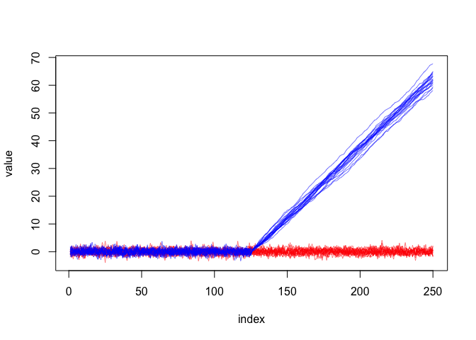

<!-- README.md is generated from README.Rmd. Please edit that file -->

# tsrf

<!-- badges: start -->

[](https://www.tidyverse.org/lifecycle/#experimental)
[](https://CRAN.R-project.org/package=tsrf)
<!-- badges: end -->

tsrf provides time series classification tools based on the Time Series
Random Forest algorithm by [Deng et al.
(2013)](https://doi.org/10.1016/j.ins.2013.02.030).

## Installation

You can install the development version of `tsrf` from
[GitHub](https://github.com/) with:

``` r
# install.packages("devtools")
devtools::install_github("FlukeAndFeather/tsrf")
```

## Example

This example demonstrates how `tsrf` extracts features, fits a model,
and makes predictions. First, generate 10 time series from two different
underlying classes

``` r
library(tsrf)
set.seed(1733)
tsnum <- 20
tslbl <- factor(rep(c("A", "B"), each = tsnum))
tslen <- 250
Aval <- replicate(tsnum, rnorm(tslen))
Bval <- replicate(tsnum, c(rnorm(tslen / 2), cumsum(rnorm(tslen / 2, 0.5, 0.2))))
tsdat <- tibble::as_tibble(data.frame(
  id = rep(1:(2 * tsnum), each = tslen),
  val = c(as.numeric(Aval), as.numeric(Bval))
))
tibble::as_tibble(tsdat)
#> # A tibble: 10,000 x 2
#>       id    val
#>    <int>  <dbl>
#>  1     1 -0.198
#>  2     1 -0.703
#>  3     1 -0.480
#>  4     1 -1.39 
#>  5     1  0.459
#>  6     1 -1.34 
#>  7     1  0.981
#>  8     1  1.26 
#>  9     1  0.275
#> 10     1  2.09 
#> # … with 9,990 more rows
```

Time series from the first class (red) have no trend but the second half
of time series from the second class trend upwards.

``` r
plot(seq(tslen), tsdat$val[tsdat$id == 1],
     type = "l", col = "#FF000088", ylim = range(tsdat$val),
     xlab = "index", ylab = "value")
for (i in 2:(tsnum * 2)) {
  lines(seq(tslen), tsdat$val[tsdat$id == i],
        col = if (i <= tsnum) "#FF000088" else "#0000FF88")
}
```



The features extracted from each time series are simple summary
statistics (mean, sd, slope) of randomly sampled intervals. Points
closer to the middle of the time series will end up in more intervals.
`extract_features()` converts long format time series data to wide
format, with one row per time series and a column for each feature.

``` r
tsints <- sample_intervals(tslen)
tsfeat <- extract_features(tsdat, "id", tsints)

prevalence <- sapply(
  seq(tslen),
  function(i) sum(i >= tsints[, 1] & i <= tsints[, 2]) / nrow(tsints)
)
plot(seq(tslen), prevalence, type = "l", xlab = "index")
```


``` r

tibble::as_tibble(tsfeat)
#> # A tibble: 40 x 676
#>       id mean_val_1 sd_val_1 slope_val_1 mean_val_2 sd_val_2 slope_val_2
#>    <int>      <dbl>    <dbl>       <dbl>      <dbl>    <dbl>       <dbl>
#>  1     1   -0.107      0.944  -0.00570       0.0822    1.01    -0.00349 
#>  2     2   -0.0414     1.02    0.000914     -0.0487    1.06    -0.00233 
#>  3     3    0.224      1.09   -0.00169       0.0638    1.06     0.00532 
#>  4     4    0.0805     0.889   0.000582      0.0164    1.01    -0.000800
#>  5     5   -0.00361    0.964   0.0000832    -0.104     0.977    0.00389 
#>  6     6   -0.103      0.950   0.0101        0.0117    1.02    -0.00624 
#>  7     7    0.0806     0.917   0.00278       0.0422    0.900   -0.00430 
#>  8     8   -0.0977     1.13   -0.00767       0.0372    1.12    -0.00288 
#>  9     9    0.0489     1.13    0.00449      -0.0392    1.05     0.00418 
#> 10    10    0.181      0.929  -0.00167       0.129     0.966    0.00276 
#> # … with 30 more rows, and 669 more variables: mean_val_3 <dbl>,
#> #   sd_val_3 <dbl>, slope_val_3 <dbl>, mean_val_4 <dbl>, sd_val_4 <dbl>,
#> #   slope_val_4 <dbl>, mean_val_5 <dbl>, sd_val_5 <dbl>, slope_val_5 <dbl>,
#> #   mean_val_6 <dbl>, sd_val_6 <dbl>, slope_val_6 <dbl>, mean_val_7 <dbl>,
#> #   sd_val_7 <dbl>, slope_val_7 <dbl>, mean_val_8 <dbl>, sd_val_8 <dbl>,
#> #   slope_val_8 <dbl>, mean_val_9 <dbl>, sd_val_9 <dbl>, slope_val_9 <dbl>,
#> #   mean_val_10 <dbl>, sd_val_10 <dbl>, slope_val_10 <dbl>, mean_val_11 <dbl>,
#> #   sd_val_11 <dbl>, slope_val_11 <dbl>, mean_val_12 <dbl>, sd_val_12 <dbl>,
#> #   slope_val_12 <dbl>, mean_val_13 <dbl>, sd_val_13 <dbl>, slope_val_13 <dbl>,
#> #   mean_val_14 <dbl>, sd_val_14 <dbl>, slope_val_14 <dbl>, mean_val_15 <dbl>,
#> #   sd_val_15 <dbl>, slope_val_15 <dbl>, mean_val_16 <dbl>, sd_val_16 <dbl>,
#> #   slope_val_16 <dbl>, mean_val_17 <dbl>, sd_val_17 <dbl>, slope_val_17 <dbl>,
#> #   mean_val_18 <dbl>, sd_val_18 <dbl>, slope_val_18 <dbl>, mean_val_19 <dbl>,
#> #   sd_val_19 <dbl>, slope_val_19 <dbl>, mean_val_20 <dbl>, sd_val_20 <dbl>,
#> #   slope_val_20 <dbl>, mean_val_21 <dbl>, sd_val_21 <dbl>, slope_val_21 <dbl>,
#> #   mean_val_22 <dbl>, sd_val_22 <dbl>, slope_val_22 <dbl>, mean_val_23 <dbl>,
#> #   sd_val_23 <dbl>, slope_val_23 <dbl>, mean_val_24 <dbl>, sd_val_24 <dbl>,
#> #   slope_val_24 <dbl>, mean_val_25 <dbl>, sd_val_25 <dbl>, slope_val_25 <dbl>,
#> #   mean_val_26 <dbl>, sd_val_26 <dbl>, slope_val_26 <dbl>, mean_val_27 <dbl>,
#> #   sd_val_27 <dbl>, slope_val_27 <dbl>, mean_val_28 <dbl>, sd_val_28 <dbl>,
#> #   slope_val_28 <dbl>, mean_val_29 <dbl>, sd_val_29 <dbl>, slope_val_29 <dbl>,
#> #   mean_val_30 <dbl>, sd_val_30 <dbl>, slope_val_30 <dbl>, mean_val_31 <dbl>,
#> #   sd_val_31 <dbl>, slope_val_31 <dbl>, mean_val_32 <dbl>, sd_val_32 <dbl>,
#> #   slope_val_32 <dbl>, mean_val_33 <dbl>, sd_val_33 <dbl>, slope_val_33 <dbl>,
#> #   mean_val_34 <dbl>, sd_val_34 <dbl>, slope_val_34 <dbl>, mean_val_35 <dbl>,
#> #   sd_val_35 <dbl>, slope_val_35 <dbl>, mean_val_36 <dbl>, …
```

After sampling intervals and extracting features, fit the model and make
predictions.

``` r
# Split data
train_index <- sample(seq(nrow(tsfeat)), 0.9 * nrow(tsfeat))
train_feat <- tsfeat[train_index, ]
test_feat <- tsfeat[-train_index, ]
train_lbl <- tslbl[train_index]
test_lbl <- tslbl[-train_index]

# Train model
tsrf <- train_tsrf(train_feat, train_lbl, "id")
#> Loading required package: lattice
#> Loading required package: ggplot2

# Test predictions
pred_feat <- predict(tsrf, test_feat)
caret::confusionMatrix(pred_feat, test_lbl)
#> Confusion Matrix and Statistics
#> 
#>           Reference
#> Prediction A B
#>          A 2 0
#>          B 0 2
#>                                      
#>                Accuracy : 1          
#>                  95% CI : (0.3976, 1)
#>     No Information Rate : 0.5        
#>     P-Value [Acc > NIR] : 0.0625     
#>                                      
#>                   Kappa : 1          
#>                                      
#>  Mcnemar's Test P-Value : NA         
#>                                      
#>             Sensitivity : 1.0        
#>             Specificity : 1.0        
#>          Pos Pred Value : 1.0        
#>          Neg Pred Value : 1.0        
#>              Prevalence : 0.5        
#>          Detection Rate : 0.5        
#>    Detection Prevalence : 0.5        
#>       Balanced Accuracy : 1.0        
#>                                      
#>        'Positive' Class : A          
#> 
```
